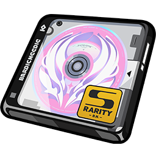
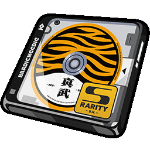
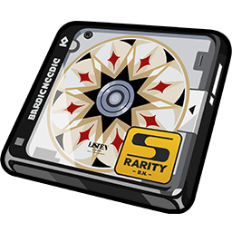

# 攻略共用圖示對照表

由 `node scripts/sync-icons.cjs` 產生。角色資料與數字引用請查 data/characters.json；操作統一使用 action。

| 引用 | 圖示 | 繁中名稱 | 分類 | Wiki ID | 備註 |
| --- | --- | --- | --- | --- | --- |
| `{{element:physical}}` |  | 物理 | element |  |  |
| `{{element:fire}}` |  | 火屬性 | element |  |  |
| `{{element:ice}}` |  | 冰屬性 | element |  |  |
| `{{element:electric}}` |  | 電屬性 | element |  |  |
| `{{element:ether}}` |  | 以太 | element |  |  |
| `{{element:wind}}` |  | 風屬性 | element |  |  |
| `{{element:light}}` |  | 流明 | element |  |  |
| `{{element:frost}}` |  | 烈霜屬性 | element |  |  |
| `{{profession:attack}}` |  | 強攻 | profession |  |  |
| `{{profession:breakthrough}}` |  | 擊破 | profession |  |  |
| `{{profession:anomaly}}` |  | 異常 | profession |  |  |
| `{{profession:support}}` |  | 支援 | profession |  |  |
| `{{profession:defensive}}` |  | 防護 | profession |  |  |
| `{{profession:rupture}}` |  | 命破 | profession |  |  |
| `{{profession:fengyu}}` |  | 鋒御 | profession |  |  |
| `{{stat:hp}}` |  | 生命值 | stat |  |  |
| `{{stat:atk}}` |  | 攻擊力 | stat |  |  |
| `{{stat:def}}` |  | 防禦力 | stat |  |  |
| `{{stat:impact}}` |  | 衝擊力 | stat |  |  |
| `{{stat:crit_rate}}` |  | 暴擊率 | stat |  |  |
| `{{stat:crit_dmg}}` |  | 暴擊傷害 | stat |  |  |
| `{{stat:anomaly_proficiency}}` |  | 異常精通 | stat |  |  |
| `{{stat:anomaly_mastery}}` |  | 異常掌控 | stat |  |  |
| `{{stat:pen_ratio}}` |  | 穿透率 | stat |  |  |
| `{{stat:pen_value}}` |  | 穿透值 | stat |  |  |
| `{{stat:energy_regen}}` |  | 能量自動回復 | stat |  |  |
| `{{stat:physical}}` |  | 物理傷害加成 | stat |  |  |
| `{{stat:fire}}` |  | 火屬性傷害加成 | stat |  |  |
| `{{stat:ice}}` |  | 冰屬性傷害加成 | stat |  |  |
| `{{stat:electric}}` |  | 電屬性傷害加成 | stat |  |  |
| `{{stat:ether}}` |  | 以太傷害加成 | stat |  |  |
| `{{stat:wind}}` |  | 風屬性傷害加成 | stat |  |  |
| `{{stat:perforation}}` |  | 貫穿力 | stat |  |  |
| `{{stat:energyaccumulation}}` |  | 閃能自動累積 | stat |  |  |
| `{{stat:accumulation}}` |  | 銳能自動累積 | stat |  |  |
| `{{stat:sharp}}` |  | 銳暴傷害 | stat |  |  |
| `{{rarity:s}}` |  | S級 | rarity |  |  |
| `{{rarity:a}}` |  | A級 | rarity |  |  |
| `{{rarity:b}}` |  | B級 | rarity |  |  |
| `{{action:normal}}` |  | 普通攻擊 | action |  |  |
| `{{action:special}}` |  | 特殊技 | action |  |  |
| `{{action:special_ready}}` |  | 強化特殊技 | action |  |  |
| `{{action:dodge}}` |  | 閃避 | action |  |  |
| `{{action:support}}` |  | 支援技 | action |  |  |
| `{{action:chain}}` |  | 連攜技 | action |  |  |
| `{{action:ultimate}}` |  | 終結技 | action |  |  |
| `{{action:ultimate_ready}}` |  | 終結技（可發動） | action |  |  |
| `{{action:core}}` |  | 核心技 | action |  |  |
| `{{action:move}}` |  | 移動 | action |  |  |
| `{{element:honededge}}` |  | 凜刃 | element |  |  |
| `{{element:auricink}}` |  | 玄墨 | element |  |  |
| `{{disc:1177}}` |  | 荊棘玫瑰 | disc | 1177 |  |
| `{{disc:1176}}` |  | 讖羽之誓 | disc | 1176 |  |
| `{{disc:1109}}` |  | 拂曉行紀 | disc | 1109 |  |
| `{{disc:1108}}` |  | 呼嘯沙龍 | disc | 1108 |  |
| `{{disc:1070}}` |  | 囚徒手記 | disc | 1070 |  |
| `{{disc:1069}}` |  | 雪兔夢遊仙境 | disc | 1069 |  |
| `{{disc:993}}` |  | 流光詠嘆 | disc | 993 |  |
| `{{disc:992}}` |  | 滄浪行歌 | disc | 992 |  |
| `{{disc:914}}` |  | 月光騎士頌 | disc | 914 |  |
| `{{disc:913}}` |  | 拂曉生花 | disc | 913 |  |
| `{{disc:790}}` |  | 山大王 | disc | 790 |  |
| `{{disc:789}}` |  | 雲巋如我 | disc | 789 |  |
| `{{disc:625}}` |  | 如影相隨 | disc | 625 |  |
| `{{disc:624}}` |  | 法厄同之歌 | disc | 624 |  |
| `{{disc:547}}` |  | 折枝劍歌 | disc | 547 |  |
| `{{disc:546}}` |  | 靜聽嘉音 | disc | 546 |  |
| `{{disc:392}}` |  | 混沌爵士 | disc | 392 |  |
| `{{disc:391}}` |  | 原始龐克 | disc | 391 |  |
| `{{disc:137}}` |  | 獠牙重金屬 | disc | 137 |  |
| `{{disc:136}}` |  | 極地重金屬 | disc | 136 |  |
| `{{disc:135}}` |  | 雷暴重金屬 | disc | 135 |  |
| `{{disc:134}}` |  | 混沌重金屬 | disc | 134 |  |
| `{{disc:133}}` |  | 炎獄重金屬 | disc | 133 |  |
| `{{disc:132}}` |  | 靈魂搖滾 | disc | 132 |  |
| `{{disc:131}}` |  | 激素龐克 | disc | 131 |  |
| `{{disc:130}}` |  | 自由藍調 | disc | 130 |  |
| `{{disc:129}}` |  | 震星迪斯可 | disc | 129 |  |
| `{{disc:128}}` |  | 河豚電音 | disc | 128 |  |
| `{{disc:127}}` |  | 啄木鳥電音 | disc | 127 |  |
| `{{disc:5}}` |  | 搖擺爵士 | disc | 5 |  |
